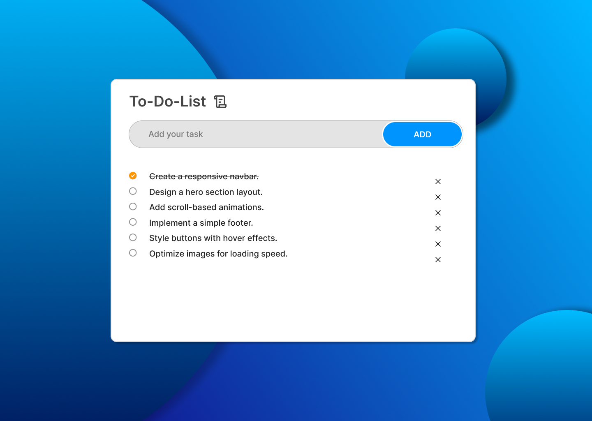

# To-Do Web App

A simple and responsive To-Do web application to help you manage your tasks efficiently. Built using **HTML**, **CSS**, **JavaScript**, and designed in **Figma**.

  
    

  

## 🚀 Features

- Add new tasks with ease.
- Mark tasks as completed.
- Delete tasks that are no longer needed.
- User-friendly and responsive design.
- Simple and intuitive interface.

---

## 🛠️ Technologies Used

- **HTML**: Structure of the app.
- **CSS**: Styling for a clean and modern design.
- **JavaScript**: Functionalities for task management.
- **Figma**: For designing the UI/UX before implementation.

---

## Live Demo  
[**View the Live Project**](https://dark1arrow.github.io/To-do-webpage/)  

## Figma Design  
[**View Figma Design**](https://www.figma.com/design/rervNKegOt7yXEDeSnH9UC/java-script-project?node-id=37-2&m=dev&t=rvBZrU5g85iSkCVm-1)  

## LinkedIn 
[**Check LinkedIn**](https://www.linkedin.com/in/gouatm-khanna-61ba63262/?utm_source=share&utm_campaign=share_via&utm_content=profile&utm_medium=android_app)
  

